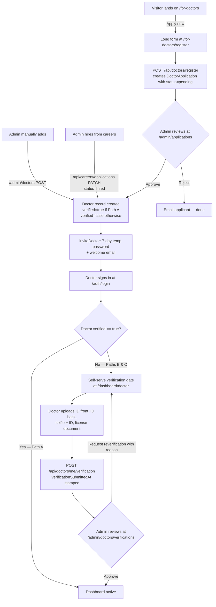

# Doctor onboarding & verification — end-to-end workflow

Three paths bring a new doctor into the platform. All three converge on a
shared invite step that issues a 7-day temp password, and **two of the
three** then hand the doctor over to a self-serve verification gate
before the dashboard activates.

This document is the canonical map. Read top-down for the user's
journey, or jump straight to the **File map** at the bottom if you're
debugging a specific step.

---

## TL;DR — three entry paths, one finish line



**Path A** — public application form — is fully document-reviewed by admin
**before** the doctor ever logs in. They get `verified=true` baked into
their Doctor record at approval time, so they skip the self-serve gate.

**Paths B & C** — manual admin add or career-hire promotion — create a
Doctor record without uploaded documents. The doctor lands on a gated
dashboard the first time they sign in and must submit their own
documents through the self-serve flow before the dashboard activates.

---

## Path A — Public application (most common)

The marketing-driven path. A doctor visits `odudoc.com/for-doctors`,
clicks **Apply now**, and fills out a 4-step form.

### Step 1 — Identity
*Form section: "Personal information"*

| Field | Required | Notes |
|---|---|---|
| Full name | yes | |
| Email | yes | unique — will become login email |
| Phone | yes | E.164 international format |
| Date of birth | yes | server enforces 18+ |
| Gender | yes | normalised to `male` / `female` server-side |
| Address | yes | free-text |
| Country | recommended | ISO 3166-1 alpha-2; drives the next step |

### Step 2 — Credentials
*Form section: "Professional credentials"*

| Field | Required | Notes |
|---|---|---|
| License number | yes | label adapts to country: NPI for US, MCI for IN, GMC for GB, etc. (`lib/medical-licenses.ts`) |
| License country | yes | drives compliance framework |
| License expiry | yes | ISO date; drives the daily license-expiry cron |
| Specialty | yes | from `DOCTOR_SPECIALTIES` enum |
| Sub-specialty | optional | free-text |
| Years experience | yes | integer |
| Qualifications | yes | free-text |
| Hospital affiliations | optional | free-text |
| Languages | yes | array, at least one |

### Step 3 — Document uploads
| Document | Required | Where it goes |
|---|---|---|
| Medical license PDF/photo | yes | Hostinger files server, `licenses/` |
| Government ID | yes | same |
| Medical degree | yes | same |
| Professional photo | yes | same — surfaced on `/find-doctors` profile |
| Specialty certs | optional | array |
| Hospital affiliation letter | optional | |

Filenames stored on the application row, blobs at `https://files.odudoc.com/licenses/...`.

### Step 4 — Plan + compliance
- Plan: `free` (default) or `premium`
- Consultation fee in USD
- **BAA / DPA / GDPR signature** — required typed-name acknowledgement.
  Which document is shown depends on `licenseCountry`:
  - US ➜ HIPAA BAA
  - EU/EEA + UK ➜ GDPR DPA
  - Everywhere else ➜ Generic DPA
  Captures version + IP + timestamp + typed signature into the
  `doctor-baa-acceptances` audit store.

### What the server does on submit
`POST /api/doctors/register` ([app/api/doctors/register/route.ts](../app/api/doctors/register/route.ts)):

1. Rate-limits 3/min/IP and 20/day/IP (`enforceRateLimit`)
2. Validates required fields + 18+ DOB
3. Normalises gender to lowercase
4. Resolves `licenseCountry` and looks up `licenseMetaFor(country)` to
   pick the framework
5. Inserts into `doctor-applications` store via `addApplication()`
6. Records the BAA/DPA acceptance in `doctor-baa-acceptances` store
7. `awaitAllFlushesStrict()` — drains both writes to Postgres before
   responding. If persist fails, returns 503 so the applicant isn't
   misled by a confirmation page.
8. Fires `addAdminNotification({ type: "doctor_application", ... })`
9. Sends `sendDoctorApplicationReceivedEmail` to the applicant
10. Returns `{ id, status: "pending" }` with HTTP 201

### Admin review
Admin opens `/admin/applications`, opens the application row, sees:
- Every demographic + credential field
- Document thumbnails / download links
- BAA/DPA acceptance metadata + signature
- Three action buttons: **Approve**, **Reject**, **Request resubmit**

`PATCH /api/admin/doctor-applications` ([app/api/admin/doctor-applications/route.ts](../app/api/admin/doctor-applications/route.ts)):

- On `approve`:
  - Updates application status
  - Calls `createDoctor()` to materialise a Doctor record with
    `status: "Active"`, the specialty, fee, etc.
  - Calls `setDoctorLicense()` to copy license metadata across
  - Calls `setDoctorVerified(doctorId, true, adminEmail)` ← admin
    review IS the verification step on Path A
  - Calls `inviteDoctor()` — see below
  - Sends `sendDoctorApplicationStatusEmail({ status: "approved" })`
- On `reject` / `resubmit`:
  - Just updates status + sends the status email

---

## Path B — Manual admin add

The "I know this doctor personally, skip the application" path.

1. Admin visits `/admin/doctors`, clicks **Add doctor**
2. Fills name + email + specialty + fee
3. `POST /api/admin/doctors` creates a Doctor row directly with
   `verified=false` and calls `inviteDoctor()`

**Result:** Doctor exists, can log in, but `verified=false` → hits the
self-serve verification gate on first sign-in.

---

## Path C — Career hire

The "candidate applied via /careers, we hired them as a doctor" path.

1. Candidate applies through `/careers` (path-of-least-resistance form)
2. HR / admin marks the application as `hired` via
   `PATCH /api/careers/applications`
3. The `hired` transition calls `createDoctor()` + `inviteDoctor()`
4. Doctor record created with `verified=false`

**Result:** Same as Path B — doctor signs in, hits the gate.

---

## The shared invite step

`lib/doctor-invite.ts → inviteDoctor()` is called from all three paths.
Idempotent. Steps:

1. Look up `User` by email
2. If missing, `createUser({ role: "doctor" })`
3. If present and role isn't doctor/admin, upgrade to `doctor`
4. `issueTempPassword(userId, 7)` — random temp password, valid 7 days
5. `markEmailVerified()` — admin-driven invite implicitly verifies the
   email (we wouldn't have it without intentional admin action)
6. `sendDoctorWelcomeEmail()` — contains the temp password and the
   sign-in URL

The doctor receives the email, clicks the link, signs in. NextAuth
session now has `role=doctor`.

---

## Self-serve verification gate (Paths B & C only)

When a doctor with `verified=false` lands on any `/dashboard/doctor/*`
page, [`app/dashboard/doctor/layout.tsx`](../app/dashboard/doctor/layout.tsx)
wraps the content in
[`components/DoctorVerificationGate.tsx`](../components/DoctorVerificationGate.tsx).
The gate fetches `/api/doctors/me/verification` and branches:

| State | What the doctor sees |
|---|---|
| `verified === true` | Gate strips out, dashboard renders |
| `verificationSubmittedAt` set, `verified === false` | "We're reviewing your documents" interstitial with a per-doc checklist |
| `verificationRejectionReason` set, no submitted-at | The admin's reason in a rose box + a fresh upload form to resubmit |
| Nothing yet | The upload form (4 file inputs + license fields) |

### Submission API
`POST /api/doctors/me/verification` ([app/api/doctors/me/verification/route.ts](../app/api/doctors/me/verification/route.ts))

- Multipart with optional fields: `idFront`, `idBack`, `selfie`, `license`
- Plus optional `licenseCountry`, `licenseNumber`, `licenseExpiry`
- 8 MB cap per file
- Uploads to Hostinger files server under category `doctor-verification`
- On any single file failure mid-flight, **rolls back prior uploads**
- Calls `submitDoctorVerification()` — stamps `verificationSubmittedAt`,
  merges new docs over existing `verificationDocs`, clears any
  `verificationRejectionReason`
- Fires `addAdminNotification({ type: "doctor_verification_submission" })`
- Drains via `awaitAllFlushesStrict()`; on persist failure rolls back
  the blobs again to avoid orphan files

---

## Admin verification queue (for Paths B & C)

`/admin/doctors/verifications` ([app/admin/doctors/verifications/page.tsx](../app/admin/doctors/verifications/page.tsx))

Tabs: **Pending review** · **Verified** · **Rejected** · **All**, each
with live counts.

Each row shows:
- Doctor identity + status pill
- Submission timestamp / verifiedAt / verifiedBy
- 4-up document grid (inline image previews; PDFs show 📄)
- License country / number / expiry sub-card

Actions:
- **✓ Approve** (or **Manual verify** when no docs uploaded — owner override) — flips `verified=true`, stamps `verifiedAt + verifiedBy`, sends "your account is verified" email
- **Request reverification** — modal asks for a reason (≥3 chars), calls `rejectDoctorVerification()` which clears `verificationSubmittedAt` and stamps `verificationRejectionReason`. Doctor sees the reason on their gate AND in their email.
- **Revoke** (verified only) — flips `verified=false`, dashboard re-gates
- **Profile** — links to `/admin/doctors?focus=<id>` for the full record

---

## State machines

### `DoctorApplication.status`
```
pending → approved   (terminal, materialises into Doctor)
        → rejected   (terminal)
        → resubmit   (re-opens — applicant edits and re-submits)
```

### `Doctor.verified` × `verificationSubmittedAt` × `verificationRejectionReason`

| `verified` | `submittedAt` | `rejectionReason` | UI on `/dashboard/doctor` |
|---|---|---|---|
| true | — | — | Dashboard renders |
| false | set | — | Pending review interstitial |
| false | unset | set | Rejected — show reason + form |
| false | unset | unset | Fresh upload form |

---

## File map

| Concern | File |
|---|---|
| Public application form | `app/for-doctors/register/page.tsx` |
| Application API (POST) | `app/api/doctors/register/route.ts` |
| Application store | `lib/doctor-applications-store.ts` |
| Admin application list/edit API | `app/api/admin/doctor-applications/route.ts` |
| Admin application UI | `app/admin/applications/page.tsx` |
| Doctor record store | `lib/doctors-store.ts` |
| Manual admin "Add doctor" API | `app/api/admin/doctors/route.ts` |
| Career hire trigger | `app/api/careers/applications/route.ts` |
| Invite (temp password + email) | `lib/doctor-invite.ts` |
| Welcome email template | `lib/email.ts → sendDoctorWelcomeEmail` |
| BAA / DPA acceptance store | `lib/doctor-baa-store.ts` |
| License country → label/regex | `lib/medical-licenses.ts` |
| Self-serve verification API | `app/api/doctors/me/verification/route.ts` |
| Self-serve gate component | `components/DoctorVerificationGate.tsx` |
| Dashboard layout (mounts the gate) | `app/dashboard/doctor/layout.tsx` |
| Admin verification queue API | `app/api/admin/doctors/verifications/route.ts` |
| Admin verification queue UI | `app/admin/doctors/verifications/page.tsx` |
| Compliance tile on dashboard | `components/DoctorComplianceTile.tsx` |

---

## Notification + email summary

| Trigger | Channel | Recipient | Template |
|---|---|---|---|
| Application submitted | email | applicant | `sendDoctorApplicationReceivedEmail` |
| Application submitted | bell | admin | `admin_notifications.doctor_application` |
| Admin approves application | email | applicant | `sendDoctorApplicationStatusEmail("approved")` |
| Admin approves application | email | doctor (via invite) | `sendDoctorWelcomeEmail` (with temp password) |
| Admin rejects application | email | applicant | `sendDoctorApplicationStatusEmail("rejected")` |
| Self-serve docs submitted | bell | admin | `admin_notifications.doctor_verification_submission` |
| Admin verifies | email | doctor | inline HTML in `/api/admin/doctors/[id]` PATCH |
| Admin rejects with reason | email | doctor | inline HTML — includes the reason verbatim |
| License expiring soon | email | doctor | daily cron `cron/license-expiry` |

---

## Common pitfalls (from launch checklist)

- **Silent persist drops** — every write path uses `awaitAllFlushesStrict`
  and returns 503 on failure rather than a misleading 201
- **Orphan blobs** — both the careers CV path and the verification
  doc path delete the just-uploaded blobs from the files server if
  the metadata write fails
- **Gender casing** — client used to send `Male` / `Female` while the
  server expected lowercase. Normalised both sides; `app/auth/register`
  and `for-doctors/register` route handler now lowercase before
  comparing
- **Idempotent invite** — `inviteDoctor()` is safe to call repeatedly;
  reuses the existing User if the email already has one and re-issues
  a fresh temp password

— Last reviewed: 2026-04-29
